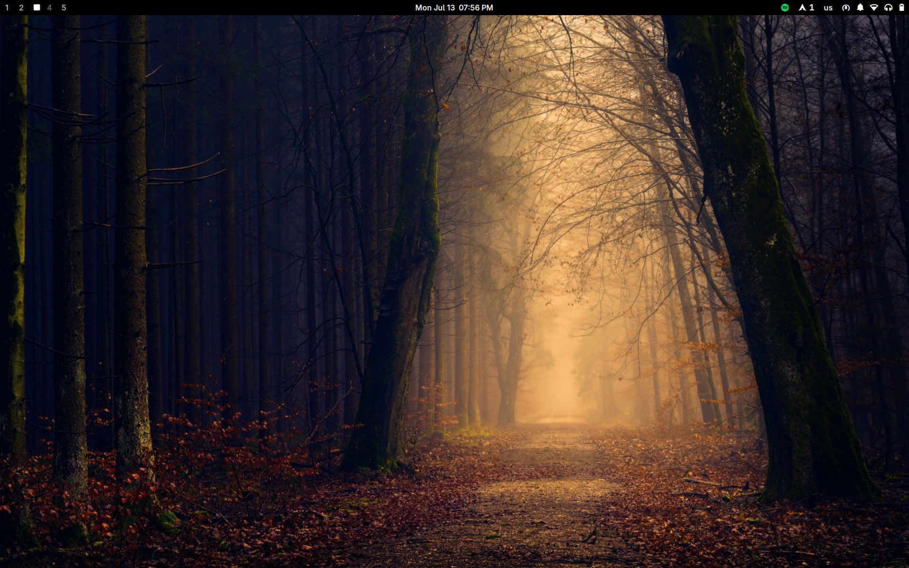

# Sway Dotfiles

A sleek, productive Sway environment with a focus on the GNOME/Adwaita ecosystem.

## Preview



## Keybindings

The `SUPER` key (Windows key) is your primary modifier.

### Applications & Utilities


| Keybind | Action |
| --- | --- |
| `$mod` + `Return` | Open Terminal |
| `$mod` + `++q` | Kill active window |
| `$mod` + `m` | Open Menu (App Launcher) |
| `$mod` + `b` | Open Web Browser |
| `$mod` + `e` | Open File Manager |
| `$mod` + `p` | Open Colorpicker |
| `$mod` + `Shift` + `b` | Open Bluetooth Manager (`bluetui`) |
| `$mod` + `Shift` + `w` | Open Network Manager (`nmtui`) |
| `$mod` + `v` | Open Clipboard History |
| `$mod` + `n` | Toggle Do Not Disturb (`dnd`) |
| `$mod` + `Shift` + `p` | Change Power Profile |
| `$mod` + `t` | Change Sway Theme |
| `$mod` + `Shift` + `t` | Toggle System Theme (Dark/Light) |
| `$mod` + `Shift` + `m` | Launch Spotify (with adblock) |
| `$mod` + `r` | Change Random Wallpaper |
| `$mod` + `Shift` + `o` | Toggle Display Mirroring |
| `$mod` + `c` | Open Scripts Menu |
| `$mod` + `Shift` + `r` | Reload Sway Configuration |
| `$mod` + `Shift` + `q` | Open Logout Menu (`wlogout`) |
| `Print` | Take Screenshot |
| `$mod` + `s` | Take Screenshot (Crop / Selection) |

---

### Window Management & Navigation


| Keybind | Action |
| --- | --- |
| `$mod` + `Arrow` / `Vim Keys` | Focus Window (Left/Down/Up/Right) |
| `$mod` + `Shift` + `Arrow` / `Vim Keys` | Move Window (Left/Down/Up/Right) |
| `$mod` + `Control` + `Arrow` | Resize Active Window |
| `$mod` + `1` to `0` | Switch to Workspace 1 - 10 |
| `$mod` + `Shift` + `1` to `0` | Move Container to Workspace 1 - 10 |
| `$mod` + `f` | Toggle Fullscreen |
| `$mod` + `Shift` + `f` | Toggle Floating Mode |
| `$mod` + `space` | Switch Keyboard Layout |
| `$mod` + `u` | Show Scratchpad |
| `$mod` + `Shift` + `u` | Move Window to Scratchpad |


## Themes

Press `mod + t` for opening the Sway Theme script.
If you want to add more themes, see `~/.config/sway/themes.json`.
You'll need to add theme Alacritty (`~/.config/alacritty/themes`) theme and the Neovim (`~/.config/nvim/lua/plugins/themes.lua`) theme.

---

## 🛠️ Core Components

* **Window Manager:** [Sway](https://swaywm.org/)
* **Bar:** [Waybar](https://github.com/Alexays/Waybar)
* **Shell:** [Fish](https://fishshell.com/) with [Starship](https://starship.rs/)
* **Terminal:** [Alacritty](https://alacritty.org/)
* **App Launcher:** [Rofi](https://github.com/davatorium/rofi)
* **File Manager:** [Nautilus](https://apps.gnome.org/en/Nautilus/)
* **Editor:** [Neovim](https://neovim.io/) + [LazyVim](http://www.lazyvim.org/)
* **SDDM Theme:** [SDDM Astronaut](https://github.com/Keyitdev/sddm-astronaut-theme)
* **Wallpapers:** [My Collection](https://github.com/dilanrojas/wallpapers.git)

---

## 📦 List of Packages

### ❄️ Sway & Desktop

AUR Helper

```bash
git clone https://aur.archlinux.org/yay.git
cd yay
makepkg -rsi
cd .. && rm -rf yay
```

Configure mirrors

```bash
yay -S rate-mirrors-bin --noconfirm

rate-mirrors --allow-root --protocol https arch | grep -v '#' | sudo tee /etc/pacman.d/mirrorlist
```

The core environment including fonts, UI tools, and GNOME apps.

```bash
yay -S swayfx swaylock-effects

sudo pacman -S sway-contrib swaybg swayidle swayosd wmname sddm hyprpicker qt6ct qt5ct waybar nwg-look nwg-displays adw-gtk-theme polkit-gnome xdg-desktop-portal-wlr xdg-desktop-portal-gtk alacritty fish starship lsd bat nautilus gnome-disk-utility loupe showtime gnome-text-editor gnome-calendar gnome-clocks gnome-calculator papers grim slurp cliphist neovim nano brightnessctl pamixer ttf-jetbrains-mono-nerd ttf-cascadia-code-nerd ttf-iosevkaterm-nerd woff2-font-awesome noto-fonts-emoji dconf-editor kcolorchooser libsecret ruby nodejs npm ripgrep fd fzf luarocks gcc lazygit git udiskie udisks2 libappindicator unzip unrar wget curl mlocate fastfetch python-pipx gnome-keyring seahorse libsecret ksshaskpass ttf-opensans breeze dunst libnotify rofi wireless-regdb playerctl papirus-icon-theme jq
```

Fonts & Basic Apps

```bash
yay -S ttf-plemoljp-bin waybar-module-pacman-updates-git wlogout brave-bin ttf-ms-fonts downgrade wayfreeze lswt appimagelauncher --noconfirm
```

```bash
# A simple program for viewing markdown files on the command line
pipx install rich-cli
```

### 🎧 Audio & Connectivity

Sound servers, Bluetooth, and Printing services.

```bash
sudo pacman -S pipewire pipewire-pulse pipewire-alsa alsa-utils pavucontrol pipewire-jack wireplumber bluez bluez-utils bluetui cups cups-pdf
```

Media codecs

```bash
sudo pacman -S gst-libav gst-plugins-base gst-plugins-good gst-plugins-bad gst-plugins-ugly x265 x264
```

### 🖥️ Xorg & Graphics & Gaming

Drivers and base display server components for hardware acceleration.

```bash
sudo pacman -S xorg xorg-server libva libva-intel-driver intel-media-driver mesa vulkan-intel vulkan-icd-loader vulkan-headers vulkan-devel vulkan-mesa-layers opencl-mesa vulkan-mesa-implicit-layers
```

### Setup zram

Using zram-generator

```bash
# Install the package
sudo pacman -S zram-generator

# Configure zram
sudo cp dotfiles/zram-generator.conf /etc/systemd/

# Enable the service
sudo systemctl enable --now  systemd-zram-setup@zram0.service
```

---

## 🚀 Installation & Setup

### 1. Enable Services

```bash
sudo systemctl enable sddm bluetooth cups

systemctl --user enable --now pipewire pipewire-pulse wireplumber
```

### 2. Deploy Dotfiles

```bash
# Copy configurations
cp -r dotfiles/.config $HOME/
cp -r dotfiles/.local $HOME/

# Clone wallpapers
git clone https://github.com/dilanrojas/wallpapers.git $HOME/Pictures/wallpapers

# Set default shell
sudo usermod --shell /usr/bin/fish $USER
sudo usermod --shell /usr/bin/fish root

# Configure git
git config --global credential.helper /usr/lib/git-core/git-credential-libsecret

# Update user directories
xdg-user-dirs-update

# Finalize theme & updatedb for locate
sudo updatedb
```

### Battery tools (Useful for a Laptop)

```bash
# Install Power Profiles Daemon
sudo pacman -S power-profiles-daemon

# Enable the services
sudo systemctl enable --now power-profiles-daemon
```

### Configuring persistent workspaces in Waybar

Get your primary monitor name.

```bash
swaymsg -t get_outputs
```

Update your waybar config.
Locate the workspaces module and check the values.

```bash
nvim ~/.config/waybar/config.json
```

### 3. SDDM & Font Rendering (Optional)

```bash
# Install SDDM Astronaut (I use Japanese Aesthetic)
sh -c "$(curl -fsSL https://raw.githubusercontent.com/keyitdev/sddm-astronaut-theme/master/setup.sh)"
```

### Improve Font Rendering

```bash
# Clone the repo and run the script
git clone https://github.com/maximilionus/lucidglyph && cd lucidglyph
sudo ./lucidglyph.sh install

# Use this for removing
#sudo ./lucidglyph.sh remove
```
