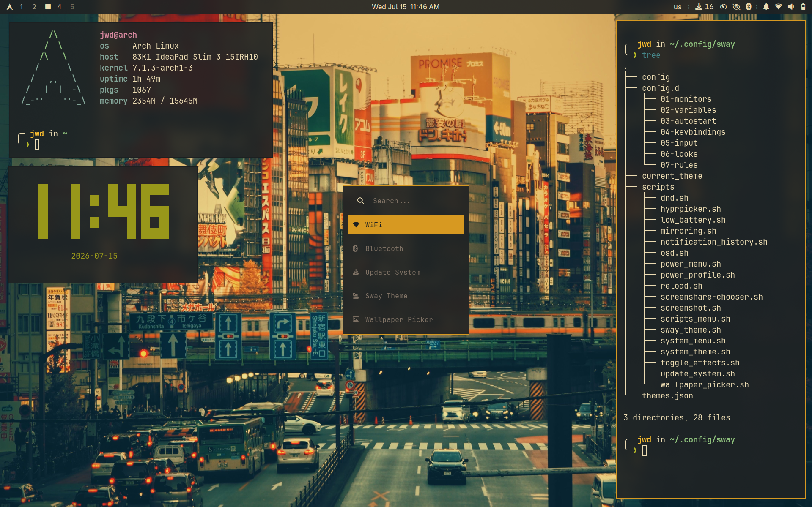

# Hyprland Dotfiles

A sleek, productive Hyprland environment with a focus on a full DE experience while being minimal.

## Preview



## Index

- [Keybindings](#keybindings)
  - [Applications \& Utilities](#applications--utilities)
  - [Window Management \& Navigation](#window-management--navigation)
- [Themes](#themes)
- [Core Components](#-core-components)
- [List of Packages](#-list-of-packages)
  - [Hyprland \& Desktop](#-hyprland--desktop)
  - [Audio \& Connectivity](#-audio--connectivity)
  - [Xorg, Graphics \& Gaming](#-xorg-graphics--gaming)
  - [Setup zram](#setup-zram)
  - [Configure Boot/ESP Flags](#configure-bootesp-flags)
  - [Battery Tools (Laptops)](#battery-tools-useful-for-a-laptop)
- [Installation \& Setup](#-installation--setup)
  - [1. Enable Services](#1-enable-services)
  - [2. Deploy Dotfiles](#2-deploy-dotfiles)
  - [Configuring Persistent Workspaces in Waybar](#configuring-persistent-workspaces-in-waybar)
  - [3. SDDM \& Font Rendering (Optional)](#3-sddm--font-rendering-optional)
  - [Improve Font Rendering](#improve-font-rendering)

---

## Keybindings

The `SUPER` key (Windows key) is your primary modifier, referred to as `$mod` below.

### Applications & Utilities

| Keybind | Action |
| --- | --- |
| `SUPER` + `RETURN` | Open Terminal (`alacritty`) |
| `SUPER` + `E` | Open File Manager (`nautilus`) |
| `SUPER` + `B` | Open Web Browser (`brave`) |
| `SUPER` + `M` | Open App Launcher (`rofi`) |
| `SUPER` + `P` | Open Color Picker (`hyprpicker`) |
| `SUPER` + `SPACE` | Switch Keyboard Layout |
| `SUPER` + `V` | Open Clipboard History |
| `SUPER` + `R` | Toggle Night Light |
| `SUPER` + `N` | Toggle Do Not Disturb |
| `SUPER` + `SHIFT` + `N` | Open Notification History |
| `SUPER` + `SHIFT` + `B` | Open Bluetooth Manager (`bluetui`) |
| `SUPER` + `SHIFT` + `W` | Open Network Manager (`wlctl`) |
| `SUPER` + `SHIFT` + `P` | Change Power Profile |
| `SUPER` + `SHIFT` + `Q` | Open Power Menu |
| `SUPER` + `SHIFT` + `R` | Reload Desktop |
| `SUPER` + `SHIFT` + `T` | Change System Theme |
| `SUPER` + `T` | Change Hyprland Theme |
| `SUPER` + `SHIFT` + `M` | Open System Menu |
| `SUPER` + `CONTROL` + `W` | Open Wallpaper Picker |
| `SUPER` + `S` | Crop/Window Screenshot |
| `SUPER` + `SHIFT` + `S` / `PRINT` | Screenshot menu (Full Screen) |

### Window Management & Layout

| Keybind | Action |
| --- | --- |
| `SUPER` + `Q` | Close Active Window |
| `SUPER` + `F` | Toggle Fullscreen |
| `SUPER` + `SHIFT` + `F` | Toggle Floating |
| `SUPER` + `O` | Toggle Pseudo Tiling |
| `SUPER` + `I` | Toggle Split |
| `SUPER` + `W` | Cycle Focus Between Floating and Tiled Windows |
| `SUPER` + `H` / `J` / `K` / `L` | Move Focus (Left / Down / Up / Right) |
| `SUPER` + `SHIFT` + `H` / `J` / `K` / `L` | Move Active Window (Left / Down / Up / Right) |
| `SUPER` + `CTRL` + `H` / `J` / `K` / `L` | Resize Active Window |
| `SUPER` + `LMB` (Drag) | Move Window |
| `SUPER` + `RMB` (Drag) | Resize Window |

### Workspaces & Scratchpad

| Keybind | Action |
| --- | --- |
| `SUPER` + `1`–`0` | Switch to Workspace 1–10 |
| `SUPER` + `SHIFT` + `1`–`0` | Move Window to Workspace 1–10 |
| `SUPER` + `U` | Toggle Special Workspace (Scratchpad) |
| `SUPER` + `SHIFT` + `U` | Move Window to Special Workspace |
| `SUPER` + `Scroll Up` / `Down` | Cycle Workspaces |

### Media & Hardware Controls

| Keybind | Action |
| --- | --- |
| `XF86AudioRaiseVolume` / `SUPER` + `F3` | Increase Volume |
| `XF86AudioLowerVolume` / `SUPER` + `F2` | Decrease Volume |
| `XF86AudioMute` / `SUPER` + `F1` | Toggle Volume Mute |
| `XF86AudioMicMute` / `SUPER` + `F4` | Toggle Mic Mute |
| `XF86MonBrightnessUp` / `SUPER` + `F6` | Increase Brightness |
| `XF86MonBrightnessDown` / `SUPER` + `F5` | Decrease Brightness |
| `XF86AudioPlay` / `Pause` / `SUPER` + `F10` / `F11` | Play / Pause Media |
| `XF86AudioNext` / `SUPER` + `F12` | Next Track |
| `XF86AudioPrev` / `SUPER` + `F9` | Previous Track |

---

## Themes

Press `SUPER` + `T` to open the Hyprland theme picker, or `SUPER` + `SHIFT` + `T` for the system theme picker.

### Architecture (folder-based)

Each theme is a self-contained folder at `~/.config/hypr/themes/<key>/`:

| File | Purpose |
| --- | --- |
| `config.json` | Metadata: `label`, `wallpaper`, `neovim_scheme`, `system_theme`, `opacity`, `icons`, `palette` |
| `wallpapers/` | Wallpaper image(s) applied as the desktop background (referenced by `config.json` → `wallpaper`) |
| `preview.png` | Thumbnail shown as the picker icon (must be provided manually) |
| `alacritty.toml` | Solid terminal colors (transparency is added at switch time) |
| `rofi.rasi` | Solid rofi colors (`accent`, `bg-primary`, `bg-secondary`, `fg`) |
| `waybar.css` | Solid Waybar colors |
| `swayosd.css` | Solid SwayOSD colors |
| `dunstrc` | 3 lines: `background` / `foreground` / `frame_color` |
| `nvim.lua` | Neovim colorscheme activation snippet |

The global switch lives in `~/.config/hypr/themes/current_theme`
(`THEME=`, `SYSTEM_THEME=`, `EFFECTS=on|off`). All Neovim plugin specs are
pre-installed in `~/.config/nvim/lua/plugins/themes.lua`, and the active
theme's `nvim.lua` is copied to `colorscheme.lua` for launch persistence.

### Adding a new theme

You can scaffold a new theme automatically with **OpenCode** (or any AI
model) using the `ADD_THEME` skill — it creates the folder, `config.json`
and every app file from a palette you provide.

> **Manual intervention still required:** you must supply the theme's
> `preview.png` (shown in the picker) and the wallpapers inside `wallpapers/`.
> You also need to add the Neovim plugin spec to `themes.lua` so the
> colorscheme gets installed.

---

## 🛠️ Core Components

| Component | Tool |
| --- | --- |
| Window Manager | [Hyprland](https://hypr.land/) |
| Bar | [Waybar](https://github.com/Alexays/Waybar) |
| Shell | [Fish](https://fishshell.com/) with [Starship](https://starship.rs/) |
| Terminal | [Alacritty](https://alacritty.org/) |
| App Launcher | [Rofi](https://github.com/davatorium/rofi) |
| File Manager | [Yazi](https://yazi-rs.github.io/) & [Nautilus](https://apps.gnome.org/en/Nautilus/) |
| Editor | [Neovim](https://neovim.io/) + [LazyVim](https://www.lazyvim.org/) |
| SDDM Theme | [SDDM Astronaut](https://github.com/Keyitdev/sddm-astronaut-theme) |
| Wallpapers | [My Collection](https://github.com/dilanrojas/wallpapers.git) |

---

## 📦 List of Packages

### ❄️ Hyprland & Desktop

**AUR Helper**

```bash
git clone https://aur.archlinux.org/yay.git
cd yay
makepkg -rsi
cd .. && rm -rf yay
```

**Configure mirrors**

```bash
yay -S rate-mirrors-bin --noconfirm

rate-mirrors --allow-root --protocol https arch | grep -v '#' | sudo tee /etc/pacman.d/mirrorlist
```

**Core environment** — fonts, UI tools:

```bash
sudo pacman -S hyprland hyprpaper hypridle hyprlock hyprsunset swayosd sddm hyprpicker qt6ct qt5ct waybar \
  nwg-look nwg-displays adw-gtk-theme polkit-gnome xdg-desktop-portal-hyprland xdg-desktop-portal-gtk \
  alacritty fish starship lsd bat nautilus gnome-disk-utility loupe celluloid gnome-text-editor \
  gnome-calendar gnome-clocks gnome-calculator papers grim slurp cliphist neovim nano \
  brightnessctl pamixer ttf-jetbrains-mono-nerd ttf-cascadia-code-nerd ttf-iosevkaterm-nerd \
  woff2-font-awesome noto-fonts-emoji dconf-editor kcolorchooser libsecret ruby nodejs npm \
  ripgrep fd fzf luarocks gcc lazygit git udiskie udisks2 libappindicator unzip unrar wget curl \
  mlocate fastfetch python-pipx gnome-keyring seahorse ksshaskpass ttf-opensans breeze \
  dunst libnotify rofi wireless-regdb playerctl papirus-icon-theme jq parted fwupd fwupd-efi \
  gnome-firmware gvfs-mtp yazi ueberzugpp loupe swappy flatpak pulsemixer gpu-screen-recorder
```

**Dev Tools + AI**

```bash
# Utilities
sudo pacman -S opencode git-delta python-pdftotext tesseract tesseract-data-eng tesseract-data-spa

# Configure git
git config --global credential.helper /usr/lib/git-core/git-credential-libsecret

# Git diff visualizer
git config --global core.pager delta
git config --global interactive.diffFilter 'delta --color-only'
git config --global delta.navigate true
git config --global delta.side-by-side true
```

**LibreOffice Suite**

```bash
sudo pacman -S libreoffice-still libreoffice-still-es ttf-caladea ttf-carlito \
  ttf-dejavu ttf-liberation noto-fonts noto-fonts-emoji adobe-source-code-pro-fonts \
  adobe-source-sans-fonts adobe-source-serif-fonts hunspell hunspell-es_cr \
  hunspell-en_us hyphen hyphen-en hyphen-es libmythes mythes-en mythes-es \
  hunspell-en_gb hunspell-es_any
```

**Fonts & basic apps**

```bash
yay -S ttf-plemoljp-bin ttf-ibmplex-mono-nerd waybar-module-pacman-updates-git brave-bin ttf-ms-fonts \
  downgrade lswt appimagelauncher wlctl-bin pfetch yaru-icon-theme grimblast-git --noconfirm
```

```bash
# A simple program for viewing markdown files on the command line
pipx install rich-cli
```

### Set up `udev` rules for AC and USB events.

This scripts will trigger the default `freedesktop` sound for plugging/unplugging an USB.

The `on-power-change.sh` script will play a sound and disable all the effects (blur and transparency) for all
the desktop components, as well as switching to the power saving mode. This will be reverted once AC is plugged in.

```bash
chmod +x dotfiles/udev/bin/*

sudo cp dotfiles/udev/bin/* /usr/local/bin/
sudo cp dotfiles/udev/rules/* /etc/udev/rules.d/

sudo udevadm control --reload-rules
sudo udevadm trigger
```

### 🎧 Audio & Connectivity

**Sound servers, Bluetooth, and printing**

```bash
sudo pacman -S pipewire pipewire-pulse pipewire-alsa alsa-utils pavucontrol pipewire-jack \
  wireplumber bluez bluez-utils bluetui cups cups-pdf
```

**Media codecs**

```bash
sudo pacman -S gst-libav gst-plugins-base gst-plugins-good gst-plugins-bad gst-plugins-ugly x265 x264
```

### 🖥️ Xorg, Graphics & Gaming

Drivers and base display server components for hardware acceleration:

```bash
sudo pacman -S xorg xorg-server libva libva-intel-driver intel-media-driver mesa vulkan-intel \
  vulkan-icd-loader vulkan-headers vulkan-devel vulkan-mesa-layers opencl-mesa \
  vulkan-mesa-implicit-layers
```

> **Note:** the `vulkan-intel` / `libva-intel-driver` packages above are Intel-specific. Swap in the
> AMD (`vulkan-radeon`, `libva-mesa-driver`) or NVIDIA (`nvidia`, `nvidia-utils`) equivalents if
> you're on different hardware.

### Setup zram

Using `zram-generator`:

```bash
# Install the package
sudo pacman -S zram-generator

# Configure zram
sudo cp dotfiles/zram-generator.conf /etc/systemd/

# Enable the service
sudo systemctl enable --now systemd-zram-setup@zram0.service
```

### Configure Boot/ESP Flags

Verify the flags:

```bash
sudo parted /dev/[your_disk] print
```

Expected output:

```text
╭─ jwd in ~
╰─❯ sudo parted /dev/nvme0n1 print
Model: SKHynix_HFS512GEM4X182N (nvme)
Disk /dev/nvme0n1: 512GB
Sector size (logical/physical): 512B/512B
Partition Table: gpt
Disk Flags:

Number  Start   End     Size    File system  Name  Flags
 1      1049kB  1001MB  1000MB  fat32              boot, esp  # <-- This is the important line
 2      1001MB  512GB   511GB   ext4
```

If your boot partition doesn't have those flags, fix it:

```bash
sudo parted /dev/[your_disk] set 1 boot on
sudo parted /dev/[your_disk] set 1 esp on
```

### Battery Tools (Useful for a Laptop)

```bash
# Install Power Profiles Daemon
sudo pacman -S power-profiles-daemon

# Enable the service
sudo systemctl enable --now power-profiles-daemon
```

---

## 🚀 Installation & Setup

### 1. Enable Services

```bash
sudo systemctl enable sddm bluetooth cups fwupd

systemctl --user enable --now pipewire pipewire-pulse wireplumber xdg-user-dirs

sudo rfkill unblock bluetooth
```

### 2. Deploy Dotfiles

```bash
# Copy configurations
cp -r dotfiles/.config $HOME/
cp -r dotfiles/.local $HOME/

# Set default shell
sudo usermod --shell /usr/bin/fish $USER
sudo usermod --shell /usr/bin/fish root

# Update user directories
xdg-user-dirs-update

# Finalize theme & updatedb for locate
sudo updatedb
```

### 3. SDDM & Font Rendering (Optional)

```bash
# Install SDDM Astronaut (Japanese Aesthetic variant used here)
sh -c "$(curl -fsSL https://raw.githubusercontent.com/keyitdev/sddm-astronaut-theme/master/setup.sh)"
```

### Improve Font Rendering

```bash
# Clone the repo and run the script
git clone https://github.com/maximilionus/lucidglyph && cd lucidglyph
sudo ./lucidglyph.sh install

# To remove:
# sudo ./lucidglyph.sh remove
```
