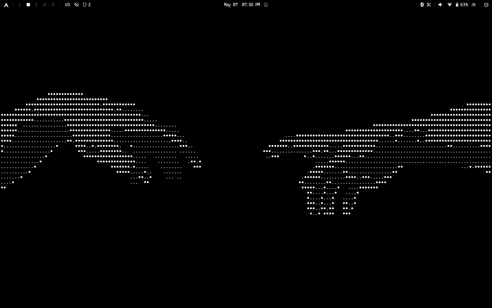

# Hyprland Dotfiles

A sleek, productive Hyprland environment with a curated list of themes and a focus on the GNOME/Adwaita ecosystem.

## Preview



---

## 🎨 Available Themes

Easily switch between professional dark and light modes.

| **Dark Themes** | **Light Themes** |
| --- | --- |
| 🪵 [Gruvbox](https://github.com/morhetz/gruvbox) | ☀️ [Solarized Light](https://github.com/maxmx03/solarized.nvim) |
| 🌊 [Kanagawa Wave](https://github.com/rebelot/kanagawa.nvim) | 🪷 [Kanagawa Lotus](https://github.com/rebelot/kanagawa.nvim) |
| 🌲 [Everforest](https://github.com/sainnhe/everforest) | 🌿 [Everforest Light](https://github.com/sainnhe/everforest) |
| ❄️ [Nordic](https://github.com/AlexvZyl/nordic.nvim) | 🌅 [Rosé Pine Dawn](https://rosepinetheme.com/) |
| 🌹 [Rosé Pine](https://rosepinetheme.com/) | 🪵 [Gruvbox Light](https://github.com/morhetz/gruvbox) |
| 🌑 [Doom One](https://github.com/NTBBloodbath/doom-one.nvim) | 🧪 [Vercel](https://github.com/tiesen243/vercel.nvim) |
| 🍵 [Catppuccin Mocha](https://catppuccin.com/) | 🎨 [Onedark](https://github.com/navarasu/onedark.nvim) |
| 🦇 [Dracula](https://draculatheme.com/) | 🏮 [Solarized Osaka](https://github.com/craftzdog/solarized-osaka.nvim) |

> [!TIP]
> **Theme Selector:** Press `SUPER` + `T` to launch the picker.
> **Customization:** Add your own themes to `~/.config/hypr/themes/`.

---

## ⌨️ Keybindings

The `SUPER` key (Windows key) is your primary modifier.

### 🚀 Applications & Utilities

| Keybind | Action |
| --- | --- |
| `SUPER` + `Enter` | Open Terminal (Alacritty) |
| `SUPER` + `B` | Open Web Browser (Brave) |
| `SUPER` + `E` | Open File Manager (Nautilus) |
| `SUPER` + `M` | App Launcher (Rofi) |
| `SUPER` + `T` | Theme Selector |
| `SUPER` + `V` | Clipboard History |
| `Print` | Screenshot (Area Select) |
| `SUPER` + `Shift` + `Q` | Logout Menu (Wlogout) |

### 🪟 Window Management

| Keybind | Action |
| --- | --- |
| `SUPER` + `Q` | Kill Active Window |
| `SUPER` + `F` | Toggle Fullscreen |
| `SUPER` + `Shift` + `F` | Toggle Floating |
| `SUPER` + `H/J/K/L` | Move Focus (Left/Down/Up/Right) |
| `SUPER` + `Shift` + `H/J/K/L` | Move Window Position |
| `SUPER` + `Ctrl` + `H/J/K/L` | Resize Active Window |

### 🔢 Workspaces

| Keybind | Action |
| --- | --- |
| `SUPER` + `1-0` | Switch to Workspace 1-10 |
| `SUPER` + `Shift` + `1-0` | Move Window to Workspace 1-10 |
| `SUPER` + `U` | Toggle Special Workspace (Scratchpad) |


---

## 🛠️ Core Components

* **Window Manager:** [Hyprland](https://hyprland.org/) (wrapped in [UWSM](https://github.com/Vladimir-csp/uwsm))
* **Bar:** [Waybar](https://github.com/Alexays/Waybar)
* **Shell:** [Fish](https://fishshell.com/) with [Starship](https://starship.rs/)
* **Terminal:** [Alacritty](https://alacritty.org/)
* **App Launcher:** [Rofi Wayland](https://github.com/in0ni/rofi-wayland)
* **File Manager:** [Nautilus](https://apps.gnome.org/en/Nautilus/)
* **Editor:** [Neovim](https://neovim.io/) + [LazyVim](http://www.lazyvim.org/)
* **SDDM Theme:** [SDDM Astronaut](https://github.com/Keyitdev/sddm-astronaut-theme)
* **Wallpapers:** [My Collection](https://github.com/dilanrojas/wallpapers.git)

---

## 📦 List of Packages

### ❄️ Hyprland & Desktop

The core environment including fonts, UI tools, and GNOME apps.

```bash
sudo pacman -S hyprland sddm hyprpicker hyprland-protocols wlroots0.19 hyprsunset hyprlock hypridle hyprpaper qt6ct qt5ct hyprcursor waybar swaync nwg-look adw-gtk-theme polkit-gnome xdg-desktop-portal-hyprland xdg-desktop-portal-gnome alacritty fish starship lsd bat nautilus gnome-disk-utility loupe showtime gnome-text-editor gnome-calendar gnome-clocks gnome-calculator papers grim slurp cliphist neovim nano brightnessctl pamixer ttf-jetbrains-mono-nerd ttf-cascadia-code-nerd ttf-iosevkaterm-nerd woff2-font-awesome noto-fonts-emoji dconf-editor kcolorchooser libsecret ruby nodejs npm ripgrep fd fzf luarocks gcc lazygit git udiskie udisks2 libappindicator unzip unrar wget curl mlocate fastfetch python-pipx kwallet kwalletmanager libsecret ksshaskpass ttf-opensans breeze libnotify rofi
```

AUR Helper

```bash
git clone https://aur.archlinux.org/yay.git
cd yay
makepkg -rsi
cd .. && rm -rf yay
```

Fonts & Apps

```bash
yay -S ttf-plemoljp-bin waybar-module-pacman-updates-git wlogout brave-bin onlyoffice-bin epson-inkjet-printer-escpr ttf-ms-fonts otf-san-francisco downgrade rate-mirrors-bin --noconfirm
```

```bash
# A simple program for viewing markdown files on the command line
pipx install rich-cli
```

### 🎧 Audio & Connectivity

Sound servers, Bluetooth, and Printing services.

```bash
sudo pacman -S pipewire pipewire-pulse pipewire-alsa alsa-utils pavucontrol pipewire-jack wireplumber bluez bluez-utils blueman cups cups-pdf
```

Media codecs

```bash
sudo pacman -S gst-libav gst-plugins-base gst-plugins-good gst-plugins-bad gst-plugins-ugly x265 x264
```

### 🖥️ Xorg & Graphics & Gaming

Drivers and base display server components for hardware acceleration.

```bash
sudo pacman -S xorg xorg-server libva libva-intel-driver intel-media-driver mesa vulkan-intel vulkan-icd-loader vulkan-headers vulkan-devel vulkan-mesa-layers opencl-mesa vulkan-mesa-implicit-layers
```

lib32 components. Must enable Multilib repos on `/etc/pacman.conf`

```bash
sudo pacman -S lib32-mesa lib32-opencl-mesa lib32-vulkan-mesa-layers lib32-vulkan-mesa-implicit-layers lib32-vulkan-icd-loader lib32-vulkan lib32-pipewire lib32-pipewire-jack lib32-vulkan-virtio lib32-vulkan-validation-layers lib32-vulkan-intel
```

Wine and various utilities. Useful for gaming

```bash
yay -S --needed wine-staging giflib lib32-giflib libpng lib32-libpng libldap lib32-libldap gnutls lib32-gnutls mpg123 lib32-mpg123 openal lib32-openal v4l-utils lib32-v4l-utils libgpg-error lib32-libgpg-error lib32-alsa-plugins alsa-lib lib32-alsa-lib libjpeg-turbo lib32-libjpeg-turbo sqlite lib32-sqlite libxcomposite lib32-libxcomposite libxinerama lib32-libxinerama libgcrypt lib32-libgcrypt libxslt lib32-libxslt libva lib32-libva gtk3 lib32-gtk3 gst-plugins-base-libs lib32-gst-plugins-base-libs
```

### Setup zram

Using zram-generator

```bash
# Install the package
sudo pacman -S zram-generator

# Configure zram
sudo cp dotfiles/zram-generator.conf /etc/systemd/

# Enable the service
sudo systemctl enable --now  systemd-zram-setup@zram0.service
```

### Configure mirrors

```bash
rate-mirrors --allow-root --protocol https arch | grep -v '#' | sudo tee /etc/pacman.d/mirrorlist
```

---

## 🚀 Installation & Setup

### 1. Enable Services

```bash
sudo systemctl enable sddm bluetooth cups

```

### 2. Deploy Dotfiles

```bash
# Copy configurations
cp -r dotfiles/.config $HOME/
cp -r dotfiles/.local $HOME/

# Clone wallpapers
git clone https://github.com/dilanrojas/wallpapers.git $HOME/Pictures/wallpapers

# Set default shell
sudo usermod --shell /usr/bin/fish $USER
sudo usermod --shell /usr/bin/fish root

# Configure git
git config --global credential.helper /usr/lib/git-core/git-credential-libsecret

# Set volume & brightness to an integer
brightnessctl set 50%
pamixer ---set-volume 50

# Finalize theme & updatedb for locate
sudo updatedb
bash ~/.config/hypr/themes/vercel/theme.sh
```

### Battery tools (Useful for a Laptop)

```bash
# Install Power Profiles Daemon
sudo pacman -S power-profiles-daemon

# Enable the services
sudo systemctl enable --now power-profiles-daemon
```

### 3. SDDM & Font Rendering (Optional)

```bash
# Install SDDM Astronaut (I use Japanese Aesthetic)
sh -c "$(curl -fsSL https://raw.githubusercontent.com/keyitdev/sddm-astronaut-theme/master/setup.sh)"
```

### Improve Font Rendering (Optional, might be too aggressive)

```bash
# Clone the repo and run the script
git clone https://github.com/maximilionus/lucidglyph && cd lucidglyph
sudo ./lucidglyph.sh install

# Use this for removing
#sudo ./lucidglyph.sh remove
```
